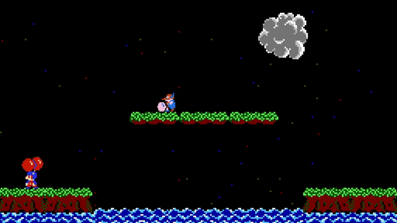

# 🎈 Réplica de Balloon Fight (Godot 3.6.1)

Este proyecto es una recreación de un nivel del clásico Balloon Fight (NES, 1986), desarrollada como parte de una materia universitaria.

Su propósito principal fue explorar la lógica y mecánicas de un juego retro, aplicando conceptos de programación en Godot Engine.

Pruébalo: https://urielara.itch.io/balloon-fight-recreation

  

## 🛠 Tecnologías usadas
- Godot Engine 3.6.1  
- GDScript  

## 🎮 Características
- Implementación de TileSet y TileMap
- Animaciones para jugador y enemigos
- Movimiento, detección de colisiones y físicas básicas
- HUD, interfaz de usuario y menú principal
- Efectos de sonido y música

