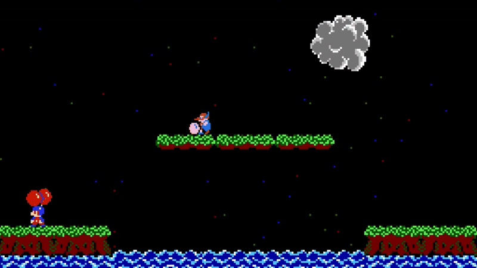

# 🎈 Recreación de Balloon Fight (Godot 3.6.1)

  

<i>Captura del gameplay</i>

 
Este proyecto es una recreación de un nivel del clásico Balloon Fight (NES, 1986), desarrollada como parte de una materia universitaria.

 Su propósito principal fue explorar la lógica y mecánicas de un juego retro, aplicando conceptos de programación en Godot Engine.
  

**🔗 Pruébalo:** [Balloon Fight Recreation - itch.io](https://urielara.itch.io/balloon-fight-recreation)

---
## 🛠 Tecnologías usadas
- Godot Engine 3.6.1  
- GDScript  
---
## 🎮 Características
- Implementación de TileSet y TileMap
- Animaciones para jugador y enemigos
- Movimiento, detección de colisiones y físicas básicas
- HUD, interfaz de usuario y menú principal
- Efectos de sonido y música

