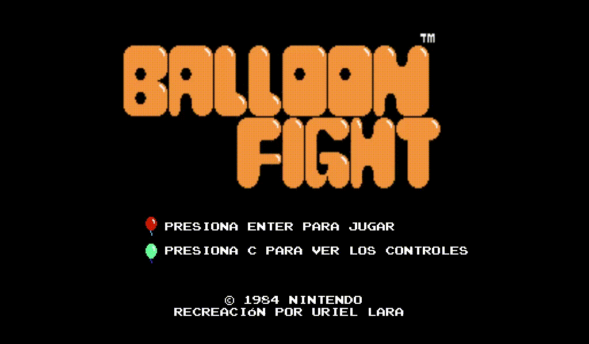

# Replica de Balloon Fight (Godot 3.6.1)

Este proyecto es una **recreación de un nivel del juego clásico Balloon Fight (NES, 1986)**, desarrollado como parte de un curso universitario.  

   

## 🛠 Tecnologías usadas
- Godot Engine 3.6.1  
- GDScript  

## 🎮 Características
- Implementación de TileSet y TileMap  
- Animación de personajes y enemigos  
- Movimiento básico de jugador y enemigos  

## 🚧 Estado del proyecto
Actualmente en desarrollo: trabajando en animaciones y lógica de enemigos.  

## 📌 Nota
Este proyecto es únicamente con fines **educativos y de aprendizaje**.  
Todos los derechos sobre *Balloon Fight* pertenecen a Nintendo. Su objetivo es **práctica académica**, no comercial.
